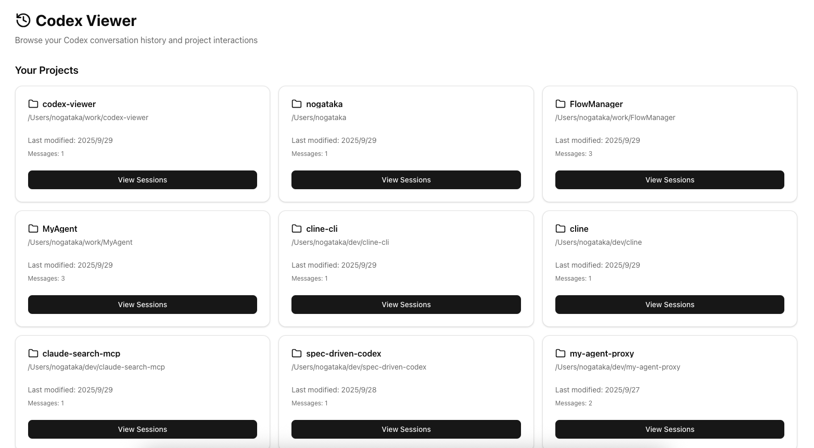
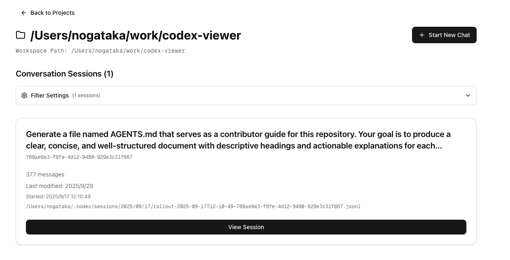
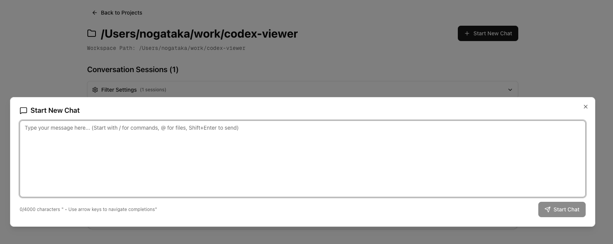

[English](./README.md) | **Japanese**

# Codex Viewer

Codex Viewer は Codex プロジェクトをブラウザから操作できるフル機能の Web クライアントです。新しい会話の開始、既存セッションの再開、実行中タスクの監視、会話履歴のブラウズなど、Codex を日常的に利用する上で必要な操作をすべて提供します。

> **注記**: このプロジェクトは d-kimuson 氏による claude-code-viewer をベースに Codex 対応へ書き換えた派生プロジェクトです。  
> オリジナル: https://github.com/d-kimuson/claude-code-viewer







## 概要

Codex Viewer は単なる会話ビューアを超え、ローカルの Codex セッションとリアルタイムに同期する Web クライアントとして進化しました。Server-Sent Events (SSE) を利用して `~/.codex/sessions/` 以下の JSONL を監視し、変化があれば即座に UI に反映します。

## 主な機能

### 対話型 Codex クライアント

- **新規チャット作成**: ブラウザから Codex セッションを開始
- **セッション再開**: 途中の会話を文脈付きで再開
- **タスク管理**: 実行中タスクの状態監視・中断が可能
- **コマンド補完**: グローバル／プロジェクト固有コマンドの入力補助
- **ステータス表示**: 実行中・待機中タスクを視覚的に把握

### リアルタイム同期

- **SSE 配信**: 双方向に近いリアルタイム更新
- **ファイル監視**: JSONL ファイルの変更を自動検知
- **タスク更新**: 進行中タスクの進捗を即表示
- **自動更新 UI**: 端末間での更新も即座に反映

### 会話管理の強化

- **プロジェクト一覧**: メタ情報付きで Codex プロジェクトを一覧表示
- **セッションフィルタ**: 空セッションの除外や重複タイトルの統合
- **マルチタブ UI**: Sessions / MCP / Settings を切り替え
- **読みやすい表示**: コードハイライト・ツール出力を整形表示
- **コマンド検出**: `git diff` や `pnpm test` の結果を構造化して表示

## インストールと利用

### クイックスタート (CLI)

```bash
PORT=3400 npx @nogataka/codex-viewer@latest
```

またはグローバルインストール:

```bash
npm install -g @nogataka/codex-viewer
codex-viewer
```

Node.js 20.12 以上、パッケージマネージャには `pnpm` (v10.8.1) を利用します。標準ではポート 3400 でサーバーが起動し、`http://localhost:3400` にアクセスすると UI が表示されます。

### リポジトリからセットアップ

```bash
git clone https://github.com/nogataka/codex-viewer.git
cd codex-viewer
pnpm install
pnpm build
pnpm start
```

## データソース

- **配置場所**: `~/.codex/sessions/<workspace>/<session-id>.jsonl`
- **フォーマット**: JSON Lines 形式の会話ログ
- **自動検出**: 新規セッションも自動で一覧に反映

## 使い方ガイド

### 1. プロジェクト一覧

- すべての Codex プロジェクトをブラウズ
- ワークスペースパス・セッション数・最終更新日時を確認
- 任意のプロジェクトを選ぶとセッション詳細へ遷移

### 2. セッションブラウザ

- プロジェクト内セッションをカード表示
- 空セッションの非表示や重複タイトルの統合が可能
- メッセージ数・タイムスタンプ・最初のコマンドで状況把握

### 3. 会話ビューア

- 会話全体を整形表示（コードはハイライト付き）
- ツール実行結果やコマンド出力も見やすく整理
- サイドバーから他セッションへすばやく移動

## 設定

### ポート

```bash
PORT=8080 npx @nogataka/codex-viewer@latest
```

### データディレクトリ

既定で `~/.codex/sessions/` を参照します。追加設定は不要です。

## ライセンス

MIT License。詳細は [LICENSE](./LICENSE) を参照してください。

## コントリビュート

開発手順や貢献の流れは [docs/dev.md](docs/dev.md) を参照してください。

## 紹介記事

Codex Viewer の背景やユースケースを詳しく知るには以下の記事もご覧ください。

- [Qiita: Codexプロジェクト管理を加速するCodex Viewerガイド](https://qiita.com/nogataka/items/28d04db421663a4a46fd) — UI 構成と活用例を詳説
- [Zenn: Codex ViewerでCodexセッションを俯瞰する](https://zenn.dev/taka000/articles/74a60c37fae5bb) — 日常運用での使いこなしポイントを紹介
