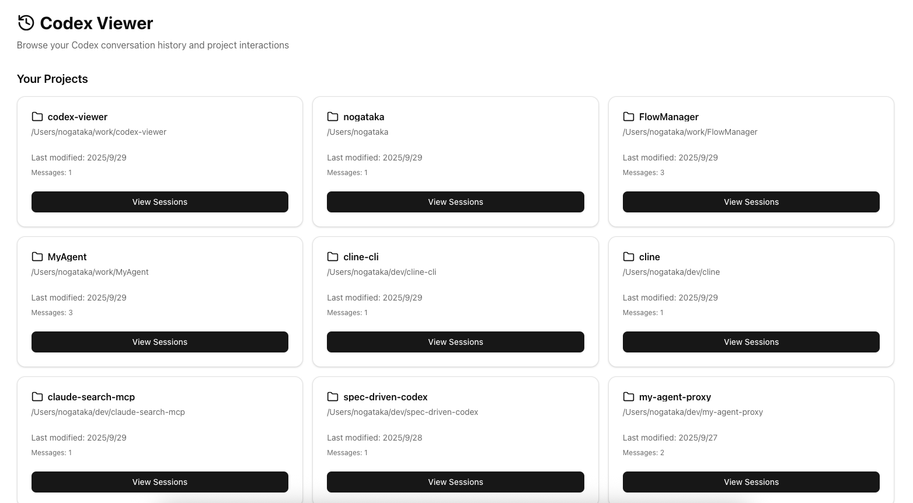

**English** | [日本語](./README.ja.md)

# Codex Viewer

Codex Viewer is a full-featured web client for Codex projects. Launch new conversations, resume existing sessions, monitor running tasks, and review historical logs directly from your browser with real-time synchronization to `~/.codex/sessions/` and `~/.codex/history.jsonl`.

> **Note**: This project is a Codex-focused fork of [claude-code-viewer](https://github.com/d-kimuson/claude-code-viewer) by d-kimuson.




## Features

### Project Explorer
- Search projects by name or path, sort by last update / name / message count, and switch between grid and table views.
- See message counts and latest activity (including updates recorded in `history.jsonl`).

### Session Management
- Resume or inspect conversations with syntax-highlighted logs and tool outputs.
- Copy `sessionId` instantly from the header; abort or resume Codex tasks from the UI.
- View diffs, command outputs, and SSE-driven updates without manual refresh.

### Automation & Integrations
- CLI automatically opens the default browser once the server is ready (Windows, Linux, macOS). Disable via `CC_VIEWER_NO_AUTO_OPEN=1` or `NO_AUTO_OPEN=1`.
- File watcher monitors both `~/.codex/sessions/` and `~/.codex/history.jsonl` to surface the latest activity in the UI.

## Quick Start

Run without installation:

```bash
PORT=3400 npx @nogataka/codex-viewer@latest
```

Codex Viewer starts the server (default port 3400) and opens `http://localhost:3400` in your browser once it becomes reachable. To skip auto-launch, export `CC_VIEWER_NO_AUTO_OPEN=1` beforehand.

### Install Globally

```bash
npm install -g @nogataka/codex-viewer
codex-viewer
```

### From Source

```bash
git clone https://github.com/nogataka/codex-viewer.git
cd codex-viewer
pnpm install
pnpm build
pnpm start
```

## Usage Guide

### 1. Projects Page
- **Filter:** Type in the search box to narrow projects by workspace name or path.
- **Sort:** Choose Last Modified, Project Name, or Message Count; toggle ascending / descending with the adjacent button.
- **Views:** Grid view shows cards with quick actions; list view renders a sortable table with compact rows and direct navigation to sessions.

### 2. Sessions Page
- **Header Controls:** Title reflects the first command; `sessionId:` badge includes a copy button and displays the UUID if present.
- **Live Status:** Running or waiting tasks surface badges and actions (abort, resume). The page auto-scrolls as new turns arrive.
- **Tooling:** Diff viewer, command outputs, and SSE updates keep the timeline synchronized with on-disk JSONL changes and `history.jsonl` events.

### 3. Real-time Sync & History
- The backend merges timestamps from both the session JSONL files and `~/.codex/history.jsonl`, so the “Last modified” column always reflects the latest Codex activity.
- File watcher broadcasts `project_changed` / `session_changed` events via SSE, allowing the UI to react immediately without polling.

## Configuration

- **Port:** `PORT=8080 npx @nogataka/codex-viewer@latest`
- **Disable Auto Browser:** `CC_VIEWER_NO_AUTO_OPEN=1` (alternatively `NO_AUTO_OPEN=1` or `NO_AUTO_BROWSER=1`)
- **Data Directory:** Defaults to `~/.codex/sessions/`. `history.jsonl` is read automatically if present.

## Development Scripts

- `pnpm dev` – Run Next.js (Turbopack) + embedded Hono API on port 3400.
- `pnpm lint` / `pnpm fix` – Format and lint via Biome.
- `pnpm typecheck` – Strict TypeScript checks.
- `pnpm test` – Execute Vitest suites.
- `pnpm build` – Produce the standalone `.next/standalone` bundle and CLI entry in `dist/`.

## Articles

Codex Viewer background and workflows are documented in:

- [Qiita: Codexプロジェクト管理を加速するCodex Viewerガイド](https://qiita.com/nogataka/items/28d04db421663a4a46fd)
- [Zenn: Codex ViewerでCodexセッションを俯瞰する](https://zenn.dev/taka000/articles/74a60c37fae5bb)

## License & Contributing

Licensed under MIT – see [LICENSE](./LICENSE). Contribution guidelines and architecture notes live in [docs/dev.md](docs/dev.md).
