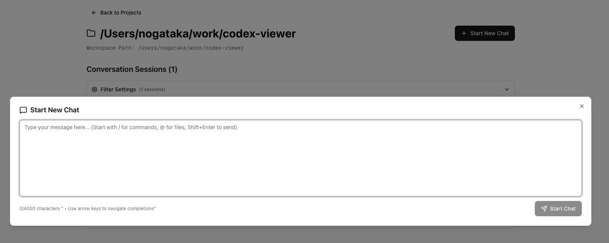

# Codexプロジェクト管理を加速する「Codex Viewer」の活用ガイド

Codexで複数プロジェクトを並行運用していると、セッションの切り替えや状態確認に手間取ることがあります。本記事では Next.js + Hono 製のウェブクライアント「Codex Viewer」を使って、ブラウザ上から Codex の作業を俯瞰し、再開（resume）やタスク管理を効率化する方法をまとめました。Qiita などの技術ブログ向けに、セットアップから代表的なユースケースまでを紹介します。

---

## 1. Codex Viewer とは

- **Codex専用のウェブクライアント**：CLI だけでは追いづらい複数プロジェクトのセッションを、一覧・検索・再開できる UI を提供
- **リアルタイム同期**：`~/.codex/sessions/` 配下の JSONL を File Watcher が監視し、Server-Sent Events (SSE) でブラウザに即反映
- **Next.js 15 / React 19 + Hono API**：モダンスタックで実装され、CLI パッケージとして `npx` ですぐ起動可能

> デモ: `PORT=3400 npx @nogataka/codex-viewer@latest` を実行して `http://localhost:3400` にアクセスすれば、既存セッションが一覧表示されます。

## 2. 導入手順

### 2.1 事前準備

- Node.js 20.12 以降
- Codex CLI と各プロジェクトの JSONL ログ（`~/.codex/sessions/<workspace>/<session-id>.jsonl`）

### 2.2 インストールと起動

```bash
# グローバルインストール
npm install -g @nogataka/codex-viewer
codex-viewer  # デフォルトでポート3400

# もしくはワンライナー
PORT=3400 npx @nogataka/codex-viewer@latest
```

ブラウザで `http://localhost:3400` を開くと、Codex projects / sessions / tasks のタブが利用できます。

## 3. UIの概要

| 画面 | 主な機能 |
| --- | --- |
| **Projects** | ワークスペースごとのプロジェクト一覧・セッション数・最終更新日時を表示。フィルタリング設定も保持。
| **Sessions** | 選択プロジェクト内のセッションをカード表示。件数や最終メッセージ時刻、最初のコマンドを一目で確認。
| **Session Detail** | JSONL を人間が読みやすいレイアウトでレンダリング。コードブロックやツール出力もハイライト付き。
| **Session Sidebar** | セッションをタブ切り替えで整理し、進行中セッションにはステータスバッジを表示して状況を把握。




## 4. プロジェクト管理のユースケース

### 4.1 Resume に必要なセッションIDを素早く取得

1. Projects 画面から対象プロジェクトを選択
2. Sessions 一覧でタイトル・最終更新日時・最初のコマンドから目的のセッションを特定
3. セッションカードのメニューから `sessionId` をコピー → ターミナルで `codex resume --session <ID>`

CLI で `ls ~/.codex/sessions/...` を探すよりも格段に速く、誤選択も防げます。

### 4.2 マルチタスク状況の可視化


- 複数開発案件を並行中でも、Projects タブで件数・最終更新を俯瞰し、詰まっている案件を即把握
- Sessions サイドバーは `aliveTasks` API の結果を元に並び替えとバッジ表示を行い、実行中 (`Running`) や待機中 (`Waiting`) のセッションを強調
- 任意のセッション詳細画面からは、ヘッダーの「Abort」ボタンで進行中タスクを即停止できる

### 4.3 セッションの重複整理

設定で「同じタイトルのセッションを統合」オプション（`unifySameTitleSession`）を有効にすると、同一コマンドから派生したセッションをまとめて表示。整理された一覧から不要なセッションをアーカイブする運用に役立ちます。

### 4.4 コードレビュー準備の高速化

Session Detail 画面では、Codex が生成した提案コードや実行ログを段落ごとに確認できるため、レビュー前に変更履歴を把握しやすい。コマンド検出機能により `git diff` や `pnpm test` の実行結果が見やすく整形されます。

### 4.5 コンソールログの読みやすいバックアップ


- Codex CLI のコンソールは行数制限や `--compact` オプションの影響で履歴が流れることがある
- Codex Viewer は JSONL をそのままレンダリングするため、過去ログを失わずに閲覧・検索できる
- コードブロックやコマンド結果はシンタックスハイライト付きで表示され、レビューや回顧の際にも視認性が高い

## 5. 設定とカスタマイズ

- 初回アクセス時に UI 設定（クッキーで保存）を調整可能
  - `hideNoUserMessageSession`: ユーザーからの入力がないセッションを非表示
  - `unifySameTitleSession`: 同タイトルのセッションを集約
- ダークテーマ切り替えや、タブレイアウトの変更も UI から操作
- サービス層は `src/server/service` にまとまっており、独自のファイル補完ロジックや git 操作を追加する際も拡張しやすい構造です

### 5.1 `aliveTasks` API とバックエンド連携

Codex Viewer のフロントエンドは、Hono API の `/api/tasks/alive` を TanStack Query でポーリングしつつ、SSE (`/api/events/state_changes`) からの push 更新でタスク一覧を反映します。バックエンドでは `CodexTaskController` が Codex CLI プロセスの状態を追跡し、シリアライズしたタスク情報を API 経由で返却します。

```ts
// 例: 開発者ツールやスクリプトから進行中タスクを取得
const response = await fetch("http://localhost:3400/api/tasks/alive");
if (!response.ok) throw new Error(await response.text());
const { aliveTasks } = await response.json();
console.log(aliveTasks);
```

`aliveTasks` に含まれる `status` や `sessionId` を元に、UI ではセッション一覧の並び替えや「Abort」操作が提供されています。

## 6. デプロイ・組織内共有のヒント

- `pnpm build` → `pnpm start` でスタンドアロン CLI を生成 (`dist/index.js`)
- ローカルネットワーク内に立て、ターミナルが苦手なメンバーにも Codex セッション状況を共有
- バックエンドは Hono API のみで完結しているため、Cloudflare Workers や Vercel Edge に載せる拡張も検討できます

## 7. まとめ

Codex Viewer を使うと、CLI から離れていても Codex のプロジェクト状態をリアルタイムに把握し、再開に必要な情報（セッションID等）をすぐに取得できます。複数プロジェクトを走らせるチームや、継続的に Codex タスクをモニタリングしたい開発者にとって、日々の UX を大幅に改善するツールです。

ぜひ一度 `npx @nogataka/codex-viewer@latest` で試し、プロジェクト管理のハブとして活用してみてください。

## 関連リンク

Codex Viewer の概要や活用事例をより詳しく知りたい場合は、以下の紹介記事も参照してください。

- [Qiita版](https://qiita.com/nogataka/items/28d04db421663a4a46fd) — 導入背景からユースケースまで網羅した解説
- [Zenn版](https://zenn.dev/taka000/articles/74a60c37fae5bb) — 実際のワークフロー例と併せてまとめた記事

